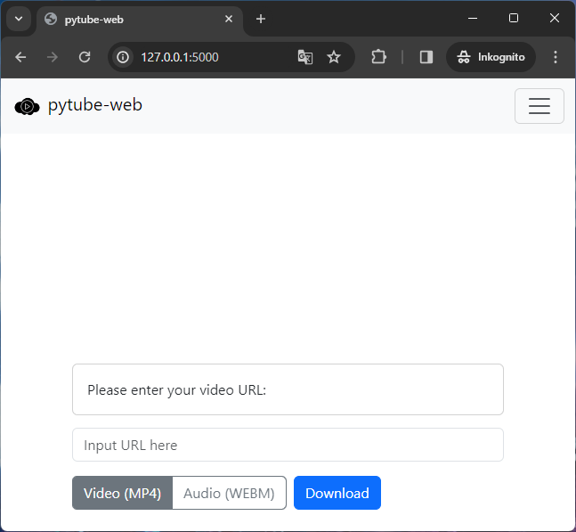

<div align="center">
    <h1>pytube-webapp</h1>
    <p>A web-based front end for pytube</p>
</div>

---

<p align="center">

</p>

## Features

- Download YouTube videos as MP4 or as WEBM

## Installation / Setup

This is a Flask-based website, so you need to install [Flask](https://pypi.org/project/Flask/) using pip like this:

```bash
pip install flask
```

After you have installed Flask, make sure to disable debug mode!  
This step is crucial!
Make sure to change the following lines in [main.py](main.py) from this:

```python
if __name__ == "__main__":
    app.run(debug=True)
```

...to this:  

```python
if __name__ == "__main__":
    app.run()
```

To start the website, run [main.py](main.py) like this:
```bash
python main.py
```

## How to use it

First, insert any URL from YouTube into the URL bar.  
  
Next, select your preferred format and click "Download"
